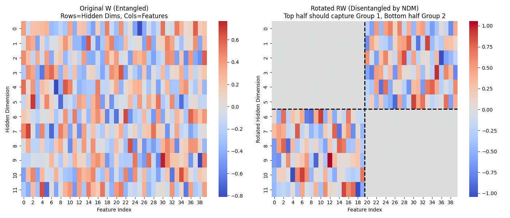

# mechinterp_mutual_exclusiveness_vs_sparsity

This is a implementation of the code behind the Huang & Hahn paper ["Decomposing Representation Space into Interpretable Subspaces with Unsupervised Learning"](https://arxiv.org/abs/2508.01916).
I mainly did this for my own learning experience. 
The paper is very fascinating though, questioning and investigating the widely held belief that sparsity is the foundational concept behind interpretability. 

Using my notebook, you can both inspect the toy model and produce figures like the following one, and investigate language models like GPT2.

